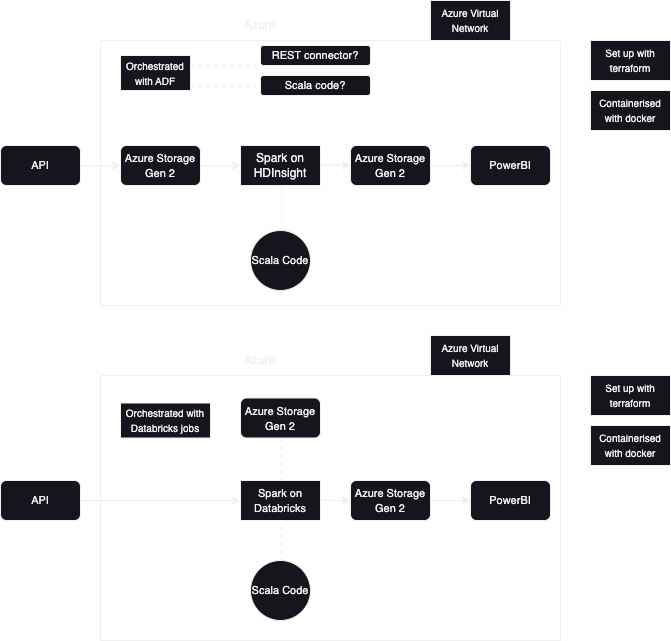

# Architectural Choices

There were two ways in which I wanted to structure the pipeline.  
The difference resides in the way Spark is used and in the way the pipeline is orchestrated.

## First Idea

My first idea was to retrieve the data from the API by using Azure Data Factory (using REST connector or Scala code).  
After this, the retrieved data would be processed using a Spark cluster on HDInsight.

## Second Idea

My second idea was to orchestrate everything using Databricks.  
The data processing would take place using a Spark cluster on Databricks.

## Choice

I opted for the second architecture, as it simpler and contains more current technologies.  
The orchestration is limited to Databricks jobs, which also makes it less complex.  
Databricks offer extensibility as it can be easily used for extended analysis.

This architecture is described in detail in [Architectural Description](architecture-description.md).

## Authentication

For now, authentication to Azure is done through az login.  
This will be changed to service principal in the final application.

## Networking Discussion

I first created a virtual network and subnets which I connected with private endpoints to account storage and key vault.  
As I ran into issues with Terraform, I changed the private endpoints to service endpoints, with network rules on the services allowing the subnet.  
This resulted in different issues, which I solved by adding my client IP to the allowed IP list.  
  
However, this setup became complex when adding a Databricks workspace and trying to connect it to the virtual network.  
Two options I tried were VNET peering and VNET injection, but these were unnecessary.  
  
I decided to remove the virtual network, subnets and service endpoints; I replaced these with adding "AzureServices" to the Bypass in network rules.  
This way, the Storage and Key Vault services are only accessible with my client IP and Azure Databricks, without having to set up a special private network.  
In the final application the IP rule will be removed, so that the application is more secure.  