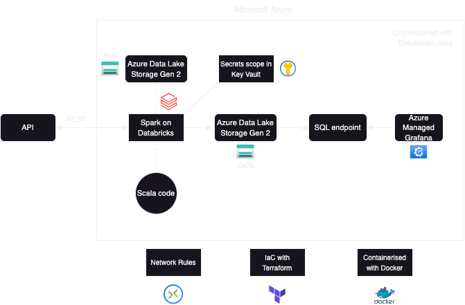

# Architecture Description

## API

The API, Tomorrow.io responds with JSON format using REST API format.  
For forecast data, the API is called every hour.  
For real-time data, the API is called every 10 minutes.

[API documentation](API-documentation.md)

## Azure Data Lake Storage Gen 2  

The raw data will be ingested into an Azure Data Lake, both for processing and for archival.  
The forecast data and real-time data will be kept in separate directories.  
The processed data is stored in a separate Azure Data Lake.  

## Spark on Databricks

Spark clusters on Databricks are used to process the data.
Although the API data is low volume, this application has scalability in mind.  
The processing part should be able to handle a lot of different API calls.

## Scala code

Scala code is written for API data retrievel and for Spark processing.  

## Orchestration

To retrieve data from the API and to process data, jobs are used.  

## Power BI

The dashboard will be delivered through Power BI.  

## Azure Virtual Network

An Azure Virtual Network with security groups is set up so that the services can communicate with each other.  

## Azure Key Vault

All configuration secrets are kept in the cloud in azure key vault to ensure security.  

## Terraform

The infrastructure for the application is automatically created with Terraform.  
The backend configuration is azurerm, this ensures security of infrastructure.

## Docker

The application is delivered as a Dockerfile.  
In this way, complexity of trying out the application is kept to a minimum.  