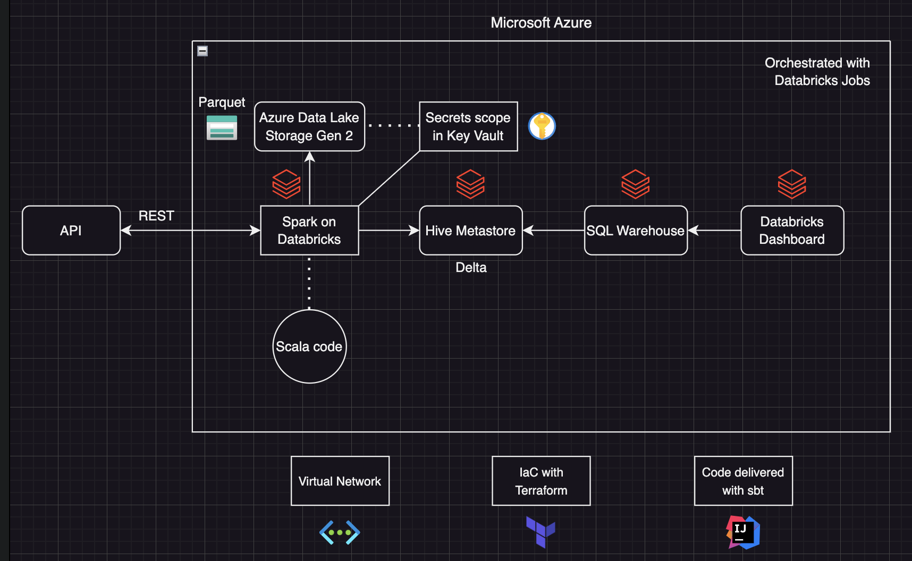

# Architecture Description

## API

The API, Tomorrow.io, is a REST API and delivers data in JSON format.  
The request is made in the Scala application.  
For forecast data, the API is called every 12 minutes.  
For realtime data, the API is called every 6 minutes.

[API documentation](API.md)

## Azure Budgets

Budgets are created for the resource groups in order to control the costs of running this architecture.

[Budget](/code/terraform/modules/azure/budget/main.tf)

## Azure Virtual Network

All resources in this application are located in the same virtual network.  
Two subnets are constructed in order to apply VNET injection for Databricks.  
Additional rule creation is possible with the network security group.  
Access to the storage account and key vault is set to private:  
only trusted Microsoft services, the subnets and the IP address of the client on which Terraform runs have acces to it.

[Virtual Network](/code/terraform/modules/azure/vnet/main.tf)

## Azure Data Lake Storage Gen 2  

The data from the API request is unpacked and enriched with the timestamp on which the it was requested.  
The files are stored in Parquet format and are partitioned on the request time and hour.  
The forecast data and realtime data are divided in separate directories.  
Access to this storage account is controlled with an account SAS token.  

[Storage](/code/terraform/modules/azure/storage/main.tf)

## Azure Key Vault

The Azure Key Vault contains the storage account SAS token, the name of the storage account and the API key.  
It serves as the secret scope of the Databricks workspace.  

[Key Vault](/code/terraform/modules/azure/keyvault/main.tf)

## Scala code

The application is written in Scala 2.12.  
It performs API data retrieval, Spark processing and data storage.  
It is developed in intelliJ IDEA CE, and built with sbt.  
The code is split up in separate packages and objects, which are then integrated into one Main object.  
It is delivered as a JAR file, uploaded as library to a cluster.  

[Code](/documentation/packages/main.md)

## Databricks cluster

Spark clusters on Databricks are used to process the data.  
Although the data is low volume, this application has scalability in mind.  
A cluster pool with the following node configuration is used to reduce job run time:  

Single node Standard_DS3_v2  
Databricks runtime 13.3 LTS, Standard, Scala 2.12  
Spark Version 3.4.1  

[Cluster Pool](/code/terraform/modules/databricks/compute/main.tf)

## Databricks Hive Metastore

The Hive metastore of the Databricks Workspace serves as the storage location of the processed data.  
Three tables (realtime, hourly_forecast, daily_forecast) are created, which each Dataframe is written to.  
Each table is a Delta table.  

[Tables](/code/terraform/modules/databricks/query/main.tf)

## Databricks SQL Warehouse

A Databricks Serverless SQL Warehouse is used to perform SQL queries on the tables in the Hive metastore.  
The queries selects specified rows which have the latest timestamp.  
Small transformations such as adding measurement units and extracting time are performed with these queries.  

[Serverless Warehouse](/code/terraform/modules/databricks/compute/main.tf)

[Queries](/code/terraform/modules/databricks/query/main.tf)

## Dashboard

The dashboard is a Databricks SQL Dashboard.  
Each query is displayed through a detailed view vizualisation and linked with a dashboard widget.  
For hourly and daily data, the user can cycle through the forecasts.  
The time displayed in the dashboard is in UTC due to an API limitation.

[Dashboard](/code/terraform/modules/databricks/visualisation/main.tf)

## Orchestration

The Scala application, SQL queries and the dashboard are orchestrated with Databricks jobs.  
There are two jobs: a forecast and a realtime job.  
Each job is split up into three tasks:  

1) Check whether a Hive metastore table exists, and if not, create one.  
2) Run the Scala pipeline which is contained in a JAR file.  
3) Refresh the dashboard with the SQL queries so that it contains the latest processed data.

[Jobs](/code/terraform/modules/databricks/job/main.tf)

## Terraform

The infrastructure for the application is automatically created with Terraform.  
The backend is located on Azure and uses partial configuration (config file) for setup.  
This application uses a service principal with contributor role as authentication method.  
The sensitive variables are inserted with an .auto.tfvars file.

[Terraform code](/code/terraform/main.tf)